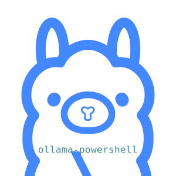

 
<a href='https://github.com/sponsors/StartAutomating'>❤️</a>
<a href='https://github.com/StartAutomating/ollama-powershell/stargazers'>⭐</a>

Play with AI in PowerShell

# Getting Started

## Installing ollama-powershell

You can install ollama-powershell from the [PowerShell Gallery](https://www.powershellgallery.com/packages/ollama-powershell/)

~~~PowerShell
Install-Module -Name ollama-powershell
~~~

To force an update, use the  `-Force`

~~~PowerShell
Install-Module -Name ollama-powershell -Force
~~~

## Importing ollama-powershell

Once ollama-powershell is installed, you can import it by name:

~~~PowerShell
Import-Module -Name ollama-powershell -PassThru
~~~

Once it is loaded, you can get commands from ollama-powershell with Get-Command

~~~PowerShell
Get-Command -Module ollama-powershell 
~~~

You can show the syntax of all commands with `Get-Command -Syntax`

~~~PowerShell
Get-Command -Module ollama-powershell -Syntax
~~~

You can get help about a command with `Get-Help`

~~~PowerShell
Get-Help Get-Ollama
~~~

You can show examples for a command with the -Examples

~~~PowerShell
Get-Help Get-Ollama -Examples
~~~

## Using ollama-powershell

There are a few ways to use ollama-powershell:

Without any parameters, or with unmapped input, `Get-Ollama` will run the `ollama` cli

~~~PowerShell
Get-Ollama
~~~

With PowerShell style parameters, `Get-Ollama` will wrap the [ollama api](https://github.com/ollama/ollama/blob/main/docs/api.md)

### Get-Ollama -Pull

Let's pull down a model:

~~~PowerShell
Get-Ollama -Pull -Model 'tinyllama'
~~~

### Get-Ollama -Chat

And now let's ask it something:

~~~PowerShell
Get-Ollama -Model 'tinyllama' -Chat 'Why is the sky blue?','Limit your response to three sentences or less.'
~~~

### Calling a model by name

If you have a model installed, you can refer to that model by name.

This is effectively a shortcut to `ollama run $ModelName`

~~~PowerShell
tinyllama "What are you?"
~~~

If you just downloaded a model and this does not work, re-import ollama-powershell with:

~~~PowerShell
Import-Module ollama-powershell -Force
~~~
